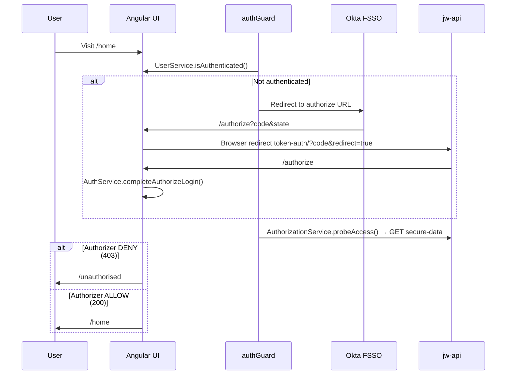

# Self-Service Analytics UI — Application Structure

This document describes how the Angular front end is organized, how requests and navigation flow through the app, and the conventions used when adding new code.

## Tech stack

- **Angular 21** — standalone components, functional route guards, lazy-loaded routes
- **NGUI** (`@cigna/cigna_dae_ngui_library`) — layout, typography, cards, header
- **API** — `jakshwealth-api` at `/jw-api/` locally (Angular dev proxy). Deployed UI builds use `https://jw-api-g.da-hpp-{env}.aws.cignacloud.com/jw-api/`.

## Directory layout

```
src/
├── environments/           # Build-time config (Okta, API URL)
├── app/
│   ├── app.ts              # Root shell: header + router-outlet
│   ├── app.routes.ts       # Top-level routes and guards
│   ├── app.config.ts       # Router, HTTP client, interceptors
│   ├── components/         # Full-page and shared UI (not feature-scoped)
│   │   ├── app-header-bar/ # Global header (nav, login, sign out)
│   │   ├── landing/        # Authenticated home (/home)
│   │   ├── about/          # Public landing (/about)
│   │   ├── authorize/      # Okta callback and logout
│   │   └── unauthorised/   # Signed in but authorizer denied
│   ├── features/           # Lazy feature areas with child routes
│   │   ├── utilization/
│   │   ├── proof-points/
│   │   └── admin/
│   ├── guards/             # Route guards (auth, logged-in)
│   ├── interceptors/       # HTTP: URL prefix, bearer token, errors
│   ├── layout/             # Shared layout wrappers for feature areas
│   ├── models/             # TypeScript interfaces (session, user)
│   └── services/           # Injectable app logic
│       ├── auth/           # Okta login, token exchange, session bootstrap
│       ├── authorization/  # API authorizer probe (secure-data)
│       ├── user/           # Session storage, expiry, refresh
│       ├── environment/    # Runtime environment accessor
│       ├── secure-data/    # Protected API call used by authorizer probe
│       └── error/          # Global HTTP error display
```

## File naming conventions

Each UI unit lives in its own folder (or feature folder) with matching base names:

| Artifact | Pattern | Example |
|----------|---------|---------|
| Component class | PascalCase | `Landing`, `AppHeaderBar` |
| Component files | `kebab-case.{ts,html,css}` | `landing.ts`, `landing.html`, `landing.css` |
| Route config | `{feature}.routes.ts` | `utilization.routes.ts` |
| Feature home | `{feature}-home.{ts,html,css}` | `utilization-home.ts` |
| Models / constants | `{component}.model.ts` | `landing.model.ts` |
| Services | `{name}.service.ts` | `auth.service.ts` |
| Guards | `{name}.guard.ts` | `auth.guard.ts` |
| Interceptors | `{name}.interceptor.ts` | `error.interceptor.ts` |

**Rules**

- Prefer `templateUrl` + `styleUrl` — keep templates and styles out of `.ts` files.
- Use `ChangeDetectionStrategy.OnPush` on presentational components.
- Selector prefix: `app-` (e.g. `app-landing`).
- British spelling for the access-denied page: `unauthorised` (route `/unauthorised`).

## Routing

Defined in `app.routes.ts`. Public routes need no guard; protected routes use `authGuard`.

| Path | Component | Guard | Purpose |
|------|-----------|-------|---------|
| `/` | redirect | — | → `/about` |
| `/about` | `About` | — | Public information |
| `/home` | `Landing` | `authGuard` | Authenticated home (authorizer must allow) |
| `/unauthorised` | `Unauthorised` | `loggedInGuard` | Signed in, authorizer denied |
| `/authorize` | `Authorize` | — | Okta return URL; completes login |
| `/login` | `Authorize` | `authGuard` | Triggers SSO when not authenticated |
| `/logout` | `Authorize` | — | Clears session |
| `/utilization` | `FeatureLayout` + children | `authGuard` | Utilization dashboard |
| `/proof-points` | `FeatureLayout` + children | `authGuard` | Proof Points dashboard (`/proof-points/ccd`, `/proof-points/tier-1`) |
| `/system_admin` | `FeatureLayout` + children | `authGuard` + `authorizerRoles: admin` | Admin-only area |

Feature child routes live in `features/{name}/{name}.routes.ts` and load a `*-home` component at `''`.

## Authentication and authorization flow

The UI **authenticates** users (Okta + session) but does **not** evaluate Okta group membership. **Authorization** is delegated to the API `ssa_authorization` Lambda by probing a protected endpoint.



### Key services

| Service | Responsibility |
|---------|----------------|
| `AuthService` | Build Okta URL; exchange auth code via API redirect; parse callback query params; complete login; token validate/refresh HTTP calls |
| `UserService` | `session_data` in `localStorage`; `isAuthenticated()` (expiry, silent refresh); `createSession` / `logout` |
| `AuthorizationService` | `probeAccess()` → `GET secure-data`; caches `accessGranted` and `authorizerRoles` signals |
| `SecureDataService` | HTTP wrapper for the protected endpoint |
| `EnvironmentService` | Exposes `environment` (API URL, Okta client) |

### HTTP interceptors (order matters)

1. **`cacheControlInterceptor`** — cache headers
2. **`urlInterceptor`** — prefix relative URLs with API base (`environment.url`)
3. **`authInterceptor`** — attach `Authorization: Bearer` except for `unAuthenticatedAPI`
4. **`errorInterceptor`** — `401` → logout + `/authorize`; `403` → propagate (session kept; caller handles denial)

### Session shape

`UserSessionData` (`models/user/user.model.ts`): `accessToken`, `refreshToken`, `expiresAt`, identity fields, `globalGroups` (informational only — not used for access control).

## Component responsibilities

| Component | Role |
|-----------|------|
| `App` | Shell: `AppHeaderBar` + `<main><router-outlet>` |
| `AppHeaderBar` | Logo, About/Home nav (Home only when authorizer granted), Login / Sign out |
| `Landing` | Home page cards; navigates to feature routes on card click |
| `About` | Public copy for guests |
| `Authorize` | Okta callback handling and logout |
| `Unauthorised` | Message when signed in but API authorizer denies |
| `FeatureLayout` | `<router-outlet>` wrapper for lazy feature modules |
| `*Home` | Placeholder pages inside each feature area |

## Adding a new feature area

1. Create `src/app/features/{name}/` with `{name}-home.{ts,html,css}` and `{name}.routes.ts`.
2. Register a lazy route in `app.routes.ts` under `FeatureLayout` + `authGuard`.
3. If admin-only, set `data: { authorizerRoles: JW_ADMIN_ROLES }`.
4. Add a navigation entry in `AppHeaderBar` when the feature should appear in the header.

## Adding a new full page

1. Create `src/app/components/{name}/` with `{name}.{ts,html,css}`.
2. Add a route in `app.routes.ts` with the appropriate guard.
3. Use NGUI `ngui-typography` for text; keep business logic in services, not templates.

## Environment and local development

| File | Purpose |
|------|---------|
| `environment.ts` | Dev configuration (Okta + API) |
| `environment.model.ts` | `Environment` interface |

All users must authenticate via Okta and pass API authorization (`USER_GG` or `ADMIN_GG`) before accessing protected routes.

## Related documentation

- [README.md](./README.md) — getting started, branching, Proof Points chart config
- `docs/CCD_AUTH_AUTHORIZATION_WALKTHROUGH.md` — CCD reference walkthrough (legacy CCD repos; bypass patterns described there are not used in SSA)
- `docs/AUTH_DESIGN_PLAN.md` — historical planning notes (superseded by this document for SSA)
- `AGENTS.md` — NGUI component usage for AI-assisted development

## Proof Points charts (summary)

Chart cards use **config + API data**, not hard-coded Chart.js options in components.

1. `ProofPointsChartsService` posts to `secure-data/fetch-charts` with
   `dashboard: 'proof-points'`, `designation`, `viewId`, `timeline`, and `filters`.
2. `ChartsConfigService` loads `src/assets/config/charts.config.json`.
3. `chart-builder.ts` produces `ProofPointChartConfig` for `app-proof-point-chart-card` → `ngui-charts`.

Edit `charts.config.json` to change colors, fonts, doughnut ring size, legend, tooltip, and card dimensions.
Doughnut **copy** (title, explanation, center text, hover messages) comes from the API; bar titles still use `chartBindings` templates.

**Chart SQL (API repo):** All warehouse queries live in
`jakshwealth-api/lambda/ssa_secure_data/features/fetch_charts/query_library/queries.py`.
See that folder's [README.md](../jakshwealth-api/lambda/ssa_secure_data/features/fetch_charts/README.md)
for how to find and replace SQL by `chart_id` and timeline (YTD/YOY).
