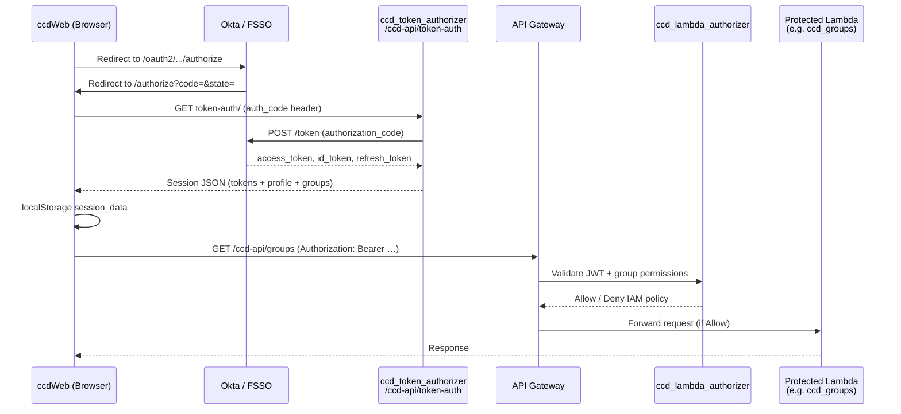

# CCD Authentication & Authorization — Step-by-Step Code Walkthrough

This document traces every step of authentication and authorization as implemented today in the sibling repositories under the parent folder:

```
SelfServiceAnalytics/
├── ccdWeb/                        ← Angular UI
├── ccdAPI/                        ← Python Lambdas + Flask local runner
└── jakshwealth-ui/     ← this repo (docs live here)
```

Paths below are relative to `SelfServiceAnalytics/` unless noted.

For SSA (this monorepo's UI + API), see [APP_STRUCTURE.md](../APP_STRUCTURE.md). SSA does **not** use the bypass or mock-login patterns described in sections 9 and below for CCD. Historical planning notes: [AUTH_DESIGN_PLAN.md](./AUTH_DESIGN_PLAN.md).

---

## 1. Architecture at a Glance



| Layer | Responsibility | Primary code |
|-------|----------------|--------------|
| **UI login redirect** | Send unauthenticated users to Okta | `ccdWeb/src/app/services/auth-guard/auth-guard.service.ts` |
| **UI callback** | Exchange auth code for session | `ccdWeb/src/app/components/authorize/authorize.component.ts` |
| **UI session** | Store tokens, refresh, role checks | `ccdWeb/src/app/services/user/user.service.ts` |
| **UI route authZ** | Per-route role requirements | `ccdWeb/src/app/app-routing.module.ts` + `UserService.verifyRoles()` |
| **UI HTTP authN** | Attach Bearer token to API calls | `ccdWeb/src/app/services/api-interceptors/auth/auth-interceptor.service.ts` |
| **API token exchange** | Okta code → JWT session (public endpoint) | `ccdAPI/lambda/ccd_token_authorizer/` |
| **API request authZ** | JWT + global-group → endpoint/method Allow/Deny | `ccdAPI/lambda/ccd_lambda_authorizer/handler.py` |
| **API permission matrix** | Which group can call which endpoint | `ccdAPI/layer/common_ccd_auth/common/allowed_apis.json` |

---

## 2. Environment & Configuration

Before any auth flow runs, both repos load per-environment settings.

### 2.1 UI environment files

| File | Purpose |
|------|---------|
| `ccdWeb/src/environments/environment.model.ts` | TypeScript interface for auth-related fields (`fssoUrl`, `clientId`, `scope`, `authBypass`, `unAuthenticatedAPI`, …) |
| `ccdWeb/src/environments/environment.dev.ts` (and `.test.ts`, `.prod.ts`, …) | Per-stage Okta URL, client ID, API base URL, role constants |
| `ccdWeb/src/environments/environment.auth-bypass.ts` | Local/dev mock login (`authBypass: true`) |
| `ccdWeb/src/app/services/environment/environment.service.ts` | Thin wrapper returning the active `environment` object |

Key dev values (`environment.dev.ts`):

- **Okta authorize URL:** `fssoUrl` → `https://YOUR_OKTA_DOMAIN/oauth2/default/v1/authorize`
- **Callback route:** `fssoRedirectRoute` → `/authorize`
- **API base:** `url` → `https://…/ccd-api/`
- **Unauthenticated paths:** `unAuthenticatedAPI` → `['token-auth', 's3.amazonaws.com']` (no Bearer header)
- **Role constants:** `ADMIN_PERMISSIONS`, `APPEALS_PERMISSIONS`, `REPORTING_PERMISSIONS`, `REGROUPER_PERMISSIONS`, `APP_ADMIN` — Okta global group names like `APISCOPE_CCD-APP-NCM_DEV`

### 2.2 API secrets & layers

| File | Purpose |
|------|---------|
| `ccdAPI/layer/common_ccd_auth/common/fsso_utils.py` | Loads Okta/FSSO secrets from AWS Secrets Manager (`OKTA_URL`, `OKTA_CLIENT`, `OKTA_SECRET`, legacy FSSO fields) |
| `ccdAPI/layer/common_ccd_auth/common/allowed_gg.json` | Valid global groups per environment (`dev`, `test`, `prod`) |
| `ccdAPI/layer/common_ccd_auth/common/allowed_apis.json` | Endpoint + HTTP method matrix per group per environment |
| `ccdAPI/layer/gg_authentication/` | SSL CA bundle layer for outbound HTTPS to Cigna services |

Each lambda declares its route and auth behavior in `integration.json`. Example — token-auth is **public**:

`ccdAPI/lambda/ccd_token_authorizer/integration.json` → `"disable_auth": ["GET", "OPTIONS", "PATCH"]`

Protected lambdas (e.g. `ccdAPI/lambda/ccd_groups/integration.json`) have no `disable_auth` — API Gateway attaches the lambda authorizer.

Terraform generation reads `disable_auth` in `ccdAPI/automation_codes/python_scripts/api_gateway_integration_creation.py` (sets `authorization = "false"` when a method is listed).

---

## 3. Login Flow — Step by Step

### Step 1 — User navigates to a protected route

**Code:** `ccdWeb/src/app/app-routing.module.ts`

Protected feature modules wire `canActivate: [AuthGuard]` and optional `data: { roles: … }`:

```typescript
{ path: 'reporting',
  canActivate: [AuthGuard],
  data: { roles: REPORTING_PERMISSIONS, … },
  loadChildren: () => import('../reporting/reporting.module')…
}
```

Routes using `UnauthGuard` (about, contact, logout) allow anonymous access but still attempt session restore.

### Step 2 — AuthGuard checks session and roles

**Code:** `ccdWeb/src/app/services/auth-guard/auth-guard.service.ts`

1. If `environment.authBypass === false` (production path):
   - Calls `userService.isAuthenticated()` (async Observable).
   - Optionally checks `phaseService.checkInPhases$()` for feature-phase gating.
   - Calls `userService.verifyRoles(route)` against `route.data.roles`.
   - If authenticated **and** valid role → `return true`.
   - Otherwise → `fssoLoginRedirect()`.

2. `fssoLoginRedirect()` builds Okta authorize query params:
   - `response_type=code`, `client_id`, `state`, `nonce`, `scope`, `redirect_uri`
   - Redirect URI = `window.location.origin + environment.fssoRedirectRoute` (e.g. `https://host/authorize`)
   - Opens `environment.fssoUrl + '?' + params` in the same window.

3. If `authBypass === true`: skips Okta; sends user to `/authorize` to pick a mock role.

### Step 3 — Okta redirects back with authorization code

**Code:** `ccdWeb/src/app/components/authorize/authorize.component.ts` (`ngOnInit`)

1. Reads query params: `code`, `state` from `ActivatedRoute`.
2. If both present → user is returning from Okta login.

Route: `{ path: 'authorize', component: AuthorizeComponent }` (no guard — must accept the callback).

Template: `ccdWeb/src/app/components/authorize/authorize.component.html` shows status messages; in bypass mode shows mock-role buttons.

### Step 4 — UI exchanges auth code for tokens (token-auth)

**Code:** `ccdWeb/src/app/services/auth/auth.service.ts` → `getAccessToken(authCode)`

```typescript
getAccessToken(authCode: string) {
  const headers = new HttpHeaders().set('auth_code', authCode);
  return this.httpClient.get<any>(`token-auth/`, { headers });
}
```

**URL resolution:** `ccdWeb/src/app/services/api-interceptors/url/url-interceptor.service.ts` prefixes `token-auth/` with `environment.url` → `{url}token-auth/`.

**No Bearer header:** `auth-interceptor.service.ts` skips URLs matching `environment.unAuthenticatedAPI` (includes `token-auth`).

### Step 5 — API receives auth code and calls Okta token endpoint

**Code:** `ccdAPI/lambda/ccd_token_authorizer/handler.py` → routes GET to `get_request_handler.py`

**Entry:** `ccdAPI/lambda/ccd_token_authorizer/handlers/get_request_handler.py` → `get_handler()`

When `auth_code` header is present:

1. **`return_accesstoken_session(headers)`** (same file):
   - Builds POST body: `client_id`, `client_secret`, `grant_type=authorization_code`, `redirect_uri` (`origin` header + `redirect_url` from secrets), `code`.
   - POSTs to `{okta_url}/token` (secrets from `fsso_utils.py`).
   - Decodes JWT claims (unverified for profile fields): access token + id token.
   - Extracts: `firstName`, `lastName`, `lanId` (`okta_retrieve_lanid`), `email`, `department`, `globalGroups` (`okta_retrieve_groups`, filtered to current `ENV`).
   - Returns JSON session:

     ```json
     {
       "firstName", "lastName", "lanId", "email", "department",
       "globalGroups", "accessToken", "refreshToken", "expiresAt"
     }
     ```

**JWT utilities:** `ccdAPI/layer/common_ccd_auth/common/fsso_utils.py`
- `okta_retrieve_lanid()` — from `samAccountName` or `sub`
- `okta_retrieve_groups()` — from `apigroups` claim (comma-separated)
- `okta_decode_token()` — full signature verification against Okta JWKS (used in validate/authorizer paths)

### Step 6 — UI upserts user profile and creates session

**Code:** `ccdWeb/src/app/components/authorize/authorize.component.ts`

After successful `getAccessToken`:

1. **`authService.updateUserProfile(...)`** — PATCH `token-auth/` with headers `func_name=update_user_profile`, `lan_id`, `first_name`, `last_name`, `email`, `department`.
2. **`createSession(response)`** — sets `fullName`, calls `userService.createSession(sessionData)`.

**API profile upsert:** `ccdAPI/lambda/ccd_token_authorizer/handlers/patch_request_handler.py` → `update_user_profile()` from `ccdAPI/layer/common_ccd_auth/common/user_profile.py` — inserts/updates `hpp_usr_prof` in Postgres.

### Step 7 — Session persisted in browser

**Code:** `ccdWeb/src/app/services/user/user.service.ts` → `createSession()`

- Sets in-memory `userSessionData`.
- Emits on `userSessionData$` Subject.
- Writes `localStorage.setItem('session_data', JSON.stringify(sessionData))`.

**Model:** `ccdWeb/src/app/models/user/user.model.ts` → `UserSessionData` interface.

After session creation, `AuthorizeComponent.refreshNavBar()` navigates to `localStorage.lastVisitedRoute` or `/`.

---

## 4. Session Validation & Token Refresh

Every guarded navigation re-validates the session.

**Code:** `ccdWeb/src/app/services/user/user.service.ts` → `isAuthenticated()`

| Condition | Action | API call |
|-----------|--------|----------|
| No `session_data` in localStorage | Return `false` | — |
| Token expires within 5 minutes **or** expired but `refreshToken` exists | Silent refresh | `AuthService.useRefreshToken()` → GET `token-auth/` with `refresh_token` header |
| Token still valid, no `globalGroups` in session | Validate token | `AuthService.validateAccessToken()` → GET `token-auth/` with `Authorization: Bearer …` |
| Token valid and groups present | Return `true` | — |
| Token expired, no refresh | `logout()` | — |

**API refresh:** `get_request_handler.py` → `refresh_token()` — POST Okta `/token` with `grant_type=refresh_token`, rebuilds session JSON.

**API validate:** `get_request_handler.py` → `validate_access_token()` — `okta_decode_token(verify=True)`, returns `{ message, expiresAt, groups }`.

**Logout:** `userService.logout()` clears memory + `localStorage.removeItem('session_data')`.

Triggered also by:
- `ccdWeb/src/app/services/api-interceptors/error/error-interceptor.service.ts` on HTTP 401/403 → logout + navigate `/login`.
- Failed refresh in `isAuthenticated()`.

---

## 5. UI Authorization (Route-Level Roles)

Authentication (valid session) ≠ authorization (allowed to see a feature).

### Step 1 — Route declares required groups

**Code:** `ccdWeb/src/app/app-routing.module.ts`

Example role mappings (from `environment.dev.ts`):

| Route | `data.roles` constant | Typical Okta groups |
|-------|----------------------|---------------------|
| `provider_admin` | `ADMIN_PERMISSIONS` | NCM, READ-ONLY, ADMIN |
| `appeals` | `APPEALS_PERMISSIONS` | NCM, READ-ONLY, ADMIN |
| `reporting` | `REPORTING_PERMISSIONS` | NCM, REPORTS-USER, READ-ONLY, ADMIN |
| `system_admin` | `APP_ADMIN` | ADMIN only |

### Step 2 — AuthGuard calls verifyRoles

**Code:** `ccdWeb/src/app/services/user/user.service.ts` → `verifyRoles(route)`

- If `route.data.roles` is undefined → allow (authenticated is enough).
- Otherwise checks intersection of user's `globalGroups` with `route.data.roles`.
- Uses `some()` — user needs **at least one** matching group.

### Step 3 — Component-level role helpers

Same file exposes convenience checks used in templates/services:

- `isAdmin()` → `ADMIN_PERMISSIONS`
- `isAppAdmin()` → `APP_ADMIN`
- `isNCM()` → `APPEALS_PERMISSIONS`
- `isECM()` → `REGROUPER_PERMISSIONS`
- `getUserRole()` → raw `globalGroups` array

---

## 6. HTTP Interceptors (Outbound API Calls)

Registered in `ccdWeb/src/app/app.module.ts` (order matters — first registered runs first on outbound):

| Interceptor | File | Behavior |
|-------------|------|----------|
| **Auth** | `api-interceptors/auth/auth-interceptor.service.ts` | Adds `Authorization: Bearer {accessToken}` unless URL matches `unAuthenticatedAPI` or Authorization is explicitly empty (S3 uploads) |
| **HTTP (mock)** | `api-interceptors/http/http-interceptor.service.ts` | Returns mock responses when `acceptMocks` and URL in `mockedAPI` |
| **URL** | `api-interceptors/url/url-interceptor.service.ts` | Prefixes relative URLs with `environment.url` (or `altUrl` via feature flag); `token-auth` always uses primary `url` |
| **Error** | `api-interceptors/error/error-interceptor.service.ts` | 401/403 → logout + `/login`; other errors retry up to 3× with 1s delay |
| **Cache-Control** | `api-interceptors/cache-control/cache-control-interceptor.service.ts` | Sets `cache-control: no-cache,no-store` on all requests |

---

## 7. API Authorization (Per-Request Lambda Authorizer)

After the UI attaches a Bearer token, **every protected API Gateway route** passes through `ccd_lambda_authorizer` before the business lambda runs.

### Step 1 — API Gateway invokes authorizer

**Code:** `ccdAPI/lambda/ccd_lambda_authorizer/handler.py` → `handler(event, context)`

Input: `{ authorizationToken, methodArn }`.

### Step 2 — Auth bypass check (non-prod / local)

```python
bypass_auth = os.getenv("AUTH_BYPASS", "false")
if bypass_auth == 'false':
    # normal path
else:
    return generate_policy('allowed_user', 'Allow', method_arn)
```

### Step 3 — JWT verification

```python
token = decode_token(authorization_token, verify=True)
```

**Code:** `ccdAPI/layer/common_ccd_auth/common/fsso_utils.py` → `decode_token()`

- Fetches FSSO JWKS from `{fsso_url}/jwks/aws_jwt_def`.
- Verifies RS256 signature, audience `oidc_ccd_confidential`, issuer from secrets.
- Returns decoded token with **`groups`** claim (comma-separated string — legacy FSSO format).

> **Note:** The token-auth lambda uses **Okta** helpers (`okta_decode_token`, `apigroups` claim) for code exchange and validation. The API Gateway authorizer still uses the legacy **`decode_token` / `groups`** path. During Okta migration, ensure tokens presented to protected endpoints are compatible with the authorizer, or that the authorizer is updated to `okta_decode_token`. E2E bypass tokens (non-prod) are handled in `okta_decode_token()` for the token-auth path.

### Step 4 — Resolve user's highest global group for the environment

**Code:** `handler.py` → `global_group_allowed()` → `gg_utils.group_for_environment()`

**File:** `ccdAPI/layer/common_ccd_auth/common/gg_utils.py`

Parses `methodArn`: `arn:aws:execute-api:{region}:{account}:{apiId}/{env}/{METHOD}/{endpoint}`

Priority order (highest wins):

1. `APISCOPE_CCD-APP-ADMIN_{ENV}`
2. `APISCOPE_CCD-APP-NCM_{ENV}`
3. `APISCOPE_CCD-APP-ECM_{ENV}`
4. `API_DUMMY-USER_{ENV}`

### Step 5 — Check endpoint + method permission

**Code:** `gg_utils.api_allowed(split_arn, group)`

Looks up `allowed_apis[environment][group][endpoint]` and verifies HTTP method is listed.

Example (`allowed_apis.json`, dev):

- `APISCOPE_CCD-APP-NCM_DEV` → `groups` → `["GET","OPTIONS","PATCH","POST","PUT"]`
- `APISCOPE_CCD-APP-REPORTS-USER_DEV` → `reports` → `["GET","OPTIONS"]`

Valid groups for an environment are listed in `allowed_gg.json`.

### Step 6 — Return IAM policy

**Code:** `handler.py` → `generate_policy(principal_id, effect, resource)`

Returns API Gateway-compatible Allow or Deny on `execute-api:Invoke` for the specific `methodArn`.

Denied requests never reach the business lambda (e.g. `ccd_groups`).

---

## 8. Other token-auth Operations

All served by `ccdAPI/lambda/ccd_token_authorizer/` at `/ccd-api/token-auth` (public — no authorizer).

| Operation | UI trigger | Request shape | Handler |
|-----------|------------|---------------|---------|
| **Code exchange** | Okta callback | `auth_code` header | `return_accesstoken_session()` |
| **Validate token** | Session restore (no groups) | `Authorization: Bearer …` | `validate_access_token()` |
| **Refresh token** | Expiring/expired session | `refresh_token` header | `refresh_token()` |
| **Websocket token** | Admin controls WS | `func_name=get_websocket_token` + Bearer | `get_websocket_token()` → DynamoDB `ccd-websocket-tokens` |
| **Update profile** | After login | PATCH + `func_name=update_user_profile` + profile headers | `patch_request_handler.py` |
| **E2E bypass** | Cypress (non-prod) | `x-e2e-test-secret` header | `_e2e_test_token()` |

**UI websocket usage:** `ccdWeb/src/app/services/app-config/app-config.service.ts` → `createConnection()` calls `authService.getWebsocketToken()`, then opens `{wsUrl}?token={token}&type=admin_controls`.

**Websocket connect:** `ccdAPI/lambda/ccd_websockets_connect/handler.py` — stores connection in DynamoDB (token validation happens at API Gateway websocket authorizer layer, not in this handler).

---

## 9. Auth Bypass & Local Development (CCD only)

> **SSA note:** `jakshwealth-ui` and `jakshwealth-api` require real Okta authentication and API authorization. There is no `authBypass`, `AUTH_BYPASS`, or E2E test-secret path in SSA.

### UI bypass mode (CCD)

**Config:** `ccdWeb/src/environments/environment.auth-bypass.ts` — `authBypass: true`

**Flow:**
1. `AuthGuard` redirects to `/authorize` instead of Okta.
2. `AuthorizeComponent` mock buttons call `mockECMAuth()`, `mockNCMAuth()`, etc.
3. Mock session data from `ccdWeb/src/app/services/auth/auth.mock.ts` (fake groups + JWT).

### API local runner

**Code:** `ccdAPI/serve.py`

- Maps `/<path>` to lambda directories via each lambda's `integration.json` `full_path`.
- Builds API Gateway-shaped `event` with normalized headers.
- Copies `common_ccd_auth` layer into `locallayer/` at startup.
- Does **not** invoke `ccd_lambda_authorizer` — local requests hit handlers directly without JWT gate (production relies on API Gateway).

### E2E test bypass (API)

**Code:** `get_request_handler.py` → `_e2e_test_token()` + `fsso_utils.get_e2e_test_credentials()`

- Non-prod only; validates `x-e2e-test-secret` against `hpp-test-automation` secret.
- Returns mock session with admin-level groups.
- Dummy access token accepted by `okta_decode_token()` when `AUTH_BYPASS` / non-prod.

---

## 10. Logout Flow

**Route:** `{ path: 'logout', component: AuthorizeComponent, canActivate: [UnauthGuard] }`

**Code:** `AuthorizeComponent.ngOnInit()` — when path is `logout`:
1. Sets `authenticated = false`.
2. Calls `userService.logout()` (clears localStorage).
3. Shows logout confirmation in template.

---

## 11. Complete File Index

### ccdWeb — Authentication

| File | Role |
|------|------|
| `ccdWeb/src/app/services/auth/auth.service.ts` | REST calls to `token-auth/` |
| `ccdWeb/src/app/services/auth/auth.mock.ts` | Mock sessions for CCD bypass mode |
| `ccdWeb/src/app/services/user/user.service.ts` | Session CRUD, refresh, role helpers |
| `ccdWeb/src/app/services/auth-guard/auth-guard.service.ts` | Protected route guard + Okta redirect |
| `ccdWeb/src/app/services/unauth-guard/unauth-guard.service.ts` | Public route guard + session restore |
| `ccdWeb/src/app/components/authorize/authorize.component.ts` | Okta callback + mock login + logout |
| `ccdWeb/src/app/components/authorize/authorize.component.html` | Login/bypass/logout UI |
| `ccdWeb/src/app/models/user/user.model.ts` | `UserSessionData` type |
| `ccdWeb/src/app/app-routing.module.ts` | Guard + role wiring on routes |
| `ccdWeb/src/app/app.module.ts` | HTTP interceptor registration |
| `ccdWeb/src/environments/environment.*.ts` | Per-env Okta + API + role constants |
| `ccdWeb/src/environments/environment.model.ts` | Environment interface |

### ccdWeb — HTTP Interceptors

| File | Role |
|------|------|
| `ccdWeb/src/app/services/api-interceptors/auth/auth-interceptor.service.ts` | Bearer token injection |
| `ccdWeb/src/app/services/api-interceptors/url/url-interceptor.service.ts` | API base URL prefix |
| `ccdWeb/src/app/services/api-interceptors/error/error-interceptor.service.ts` | 401/403 handling + retry |
| `ccdWeb/src/app/services/api-interceptors/cache-control/cache-control-interceptor.service.ts` | Cache-Control header |
| `ccdWeb/src/app/services/api-interceptors/http/http-interceptor.service.ts` | Mock API responses |

### ccdAPI — Token Service (Authentication)

| File | Role |
|------|------|
| `lambda/ccd_token_authorizer/handler.py` | HTTP method router |
| `lambda/ccd_token_authorizer/handlers/get_request_handler.py` | Code exchange, validate, refresh, websocket token, E2E |
| `lambda/ccd_token_authorizer/handlers/patch_request_handler.py` | Profile update |
| `lambda/ccd_token_authorizer/integration.json` | Route config, `disable_auth` |
| `layer/common_ccd_auth/common/fsso_utils.py` | Okta/FSSO JWT decode, secrets, E2E creds |
| `layer/common_ccd_auth/common/user_profile.py` | Postgres `hpp_usr_prof` upsert |

### ccdAPI — Request Authorizer (Authorization)

| File | Role |
|------|------|
| `lambda/ccd_lambda_authorizer/handler.py` | API Gateway TOKEN authorizer |
| `layer/common_ccd_auth/common/gg_utils.py` | Group resolution + API permission check |
| `layer/common_ccd_auth/common/allowed_apis.json` | Endpoint/method permission matrix |
| `layer/common_ccd_auth/common/allowed_gg.json` | Valid global groups per env |
| `lambda/*/integration.json` | Per-lambda route, layers, permissions, optional `disable_auth` |
| `automation_codes/python_scripts/api_gateway_integration_creation.py` | Terraform: authorizer on/off per method |

### ccdAPI — Infrastructure

| File | Role |
|------|------|
| `serve.py` | Local Flask runner, lambda routing, layer copy |
| `layer/gg_authentication/` | SSL CA bundle for outbound HTTPS |

---

## 12. End-to-End Checklist

Use this when tracing a bug or implementing the SSA equivalent:

- [ ] **Redirect:** Does `AuthGuard.fssoLoginRedirect()` use the correct `clientId`, `scope`, and `redirect_uri` for the environment?
- [ ] **Callback:** Does `/authorize` receive `code` + `state` and call `AuthService.getAccessToken()`?
- [ ] **Token exchange:** Does `ccd_token_authorizer` POST to Okta `/token` with matching `redirect_uri` (must equal what Okta registered)?
- [ ] **Session:** Is `session_data` written to localStorage with `accessToken`, `refreshToken`, `expiresAt`, `globalGroups`?
- [ ] **Profile:** Does PATCH `update_user_profile` upsert `hpp_usr_prof`?
- [ ] **Route authZ:** Does the user's `globalGroups` intersect `route.data.roles`?
- [ ] **HTTP authN:** Does `AuthInterceptor` attach Bearer for protected API URLs?
- [ ] **API authZ:** Does the JWT pass `ccd_lambda_authorizer` → `group_for_environment` → `api_allowed`?
- [ ] **Refresh:** On expiry, does `useRefreshToken` succeed and rewrite `session_data`?
- [ ] **401 handling:** Does `ErrorInterceptor` logout and send user to `/login`?
